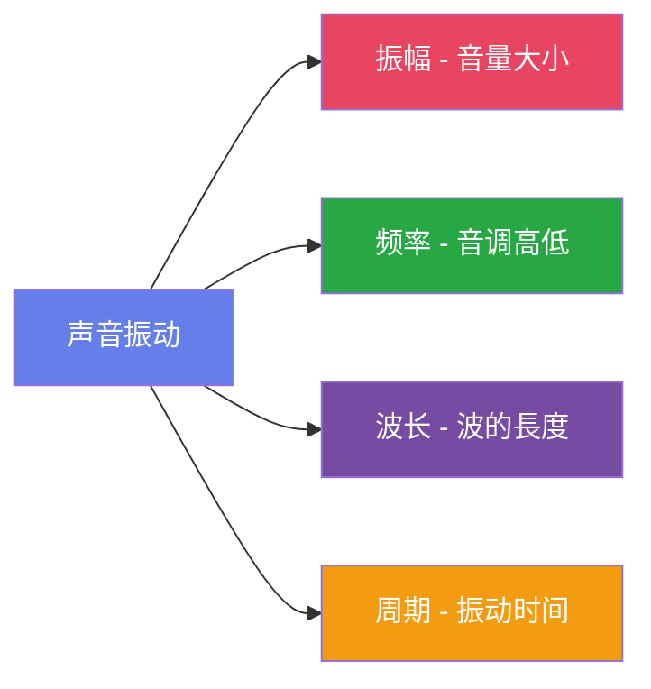
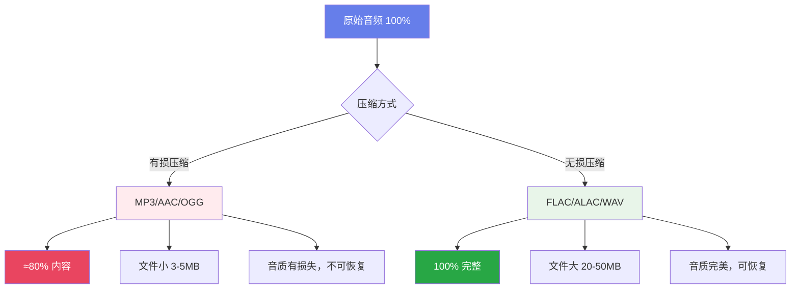
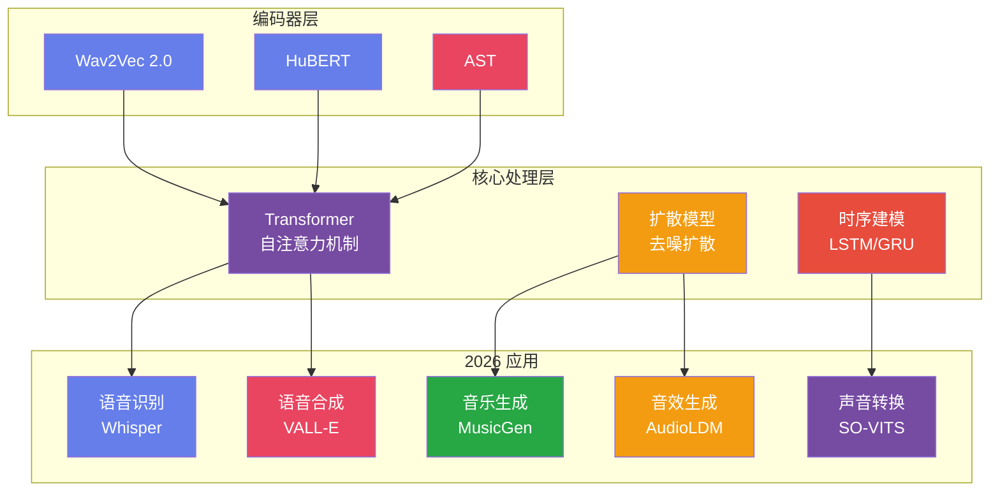
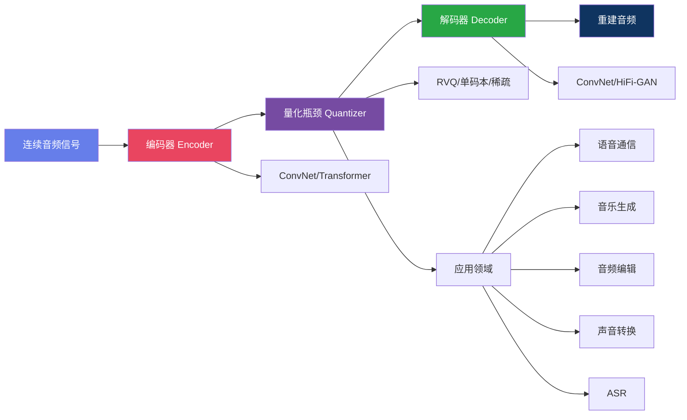
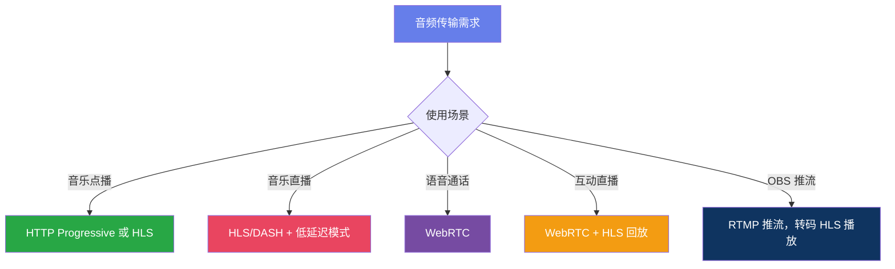
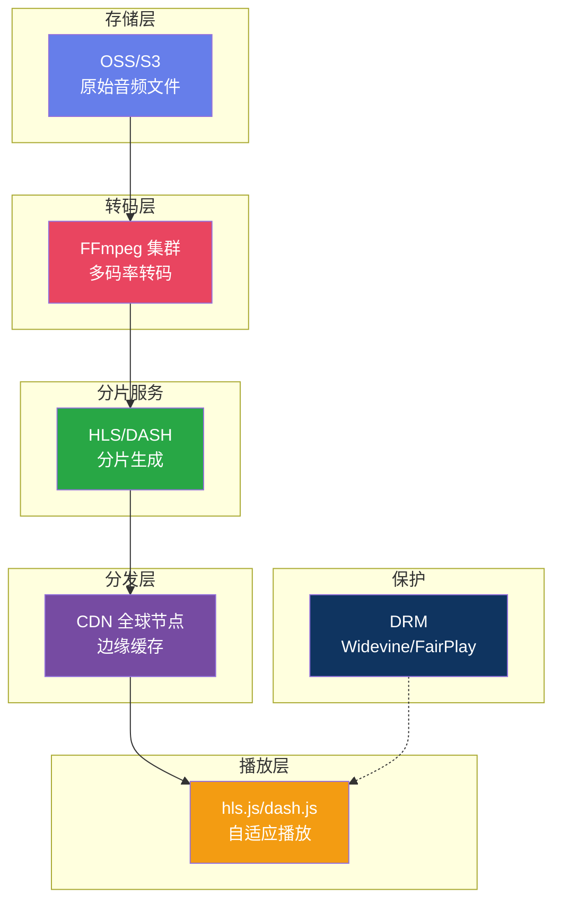

# 计算机音频处理完全指南：从基础到 2026AI 前沿技术

> 声音是如何被计算机理解和生成的？一文带你掌握音频处理的核心知识与最新 AI 技术突破

---

## 引言：声音的数字化之旅

声音是由物体振动产生的机械波，通过介质传播到我们的耳朵。2026 年的今天，AI 系统已经能够像人类一样"感知"和"理解"声音内容。从传统的信号处理到现代的深度学习方法，音频处理领域正在经历前所未有的变革。

本文将带你系统学习计算机音频处理的核心知识，并深入了解 2025-2026 年最新的 AI 音频技术突破。

---

## 第一部分：音频基础核心概念

### 1.1 声音的物理特性

声音有四个基本物理特性：

- **振幅 (Amplitude)**：声音的强度或音量，决定声音有多大
- **频率 (Frequency)**：振动的快慢，决定音调高低，单位 Hz
- **波长 (Wavelength)**：一个完整振动周期的长度
- **周期 (Period)**：完成一次完整振动所需的时间



### 1.2 模拟信号 vs 数字信号

| 特性 | 模拟信号 | 数字信号 |
|------|----------|----------|
| 时间 | 连续 | 离散 |
| 振幅 | 连续 | 离散 |
| 抗干扰 | 弱 | 强 |
| 存储 | 难 | 易 |
| 音质 | 理论无限 | 受量化限制 |

### 1.3 采样率标准与应用

根据**奈奎斯特采样定理**，采样率必须至少是信号最高频率的两倍。

| 采样率 | 应用场景 | AI 增强特性 |
|--------|----------|-------------|
| 8,000 Hz | 电话通信、AI 语音识别 | AI 语音增强预处理 |
| 44,100 Hz | CD 音质、流媒体 | AI 上采样至 96kHz |
| 48,000 Hz | 专业音频、视频 | AI 实时降噪 |
| 96,000 Hz | 高清音频、AI 音乐生成 | 高保真 AI 合成 |
| 192,000+ Hz | AI 音频分析和生成 | 超分辨率音频处理 |

### 1.4 位深度与动态范围

| 位深度 | 量化等级 | 动态范围 | AI 应用 |
|--------|----------|----------|---------|
| 16-bit | 65,536 | ~96 dB | 标准音频存储 |
| 24-bit | 16,777,216 | ~144 dB | 专业录音 |
| 32-bit float | 无限 | 理论上无限 | AI 处理中间格式 |
| AI 自适应 | 动态调整 | 内容感知 | 智能压缩存储 |

**音频文件大小计算公式：**

```
文件大小 (字节) = 采样率 × 位深度/8 × 声道数 × 时长 (秒)
```

---

## 第二部分：音频术语通俗解释

### 2.1 核心参数人话版

#### 采样率 = 每秒拍多少张照片

想象你要记录一个球的运动轨迹：
- **8kHz** = 每秒拍 8000 张 → 电话音质，能听清说话
- **44.1kHz** = 每秒拍 44100 张 → CD 音质，很清晰
- **96kHz** = 每秒拍 96000 张 → 专业录音，细节丰富

#### 位深度 = 尺子的刻度精细度

- **8-bit** = 尺子只有 256 个刻度 → 粗糙，有量化噪音
- **16-bit** = 尺子有 65536 个刻度 → CD 音质，很精确
- **24-bit** = 尺子有 1677 万个刻度 → 专业录音，超精细

#### 比特率 = 水管的粗细

- **64 kbps** = 细水管 → 播客、有声书够用
- **128 kbps** = 中等水管 → 普通音乐，手机听不错
- **320 kbps** = 粗水管 → 高质量音乐，细节丰富
- **1411 kbps** = 超大水管 → CD 无损音质

### 2.2 有损 vs 无损压缩



### 2.3 关键音质指标

| 术语 | 人话解释 | 类比 |
|------|----------|------|
| **动态范围** | 最响和最轻声音的差距 | 照片的明暗对比 |
| **信噪比** | 有用声音比背景噪音大多少 | 画面干净程度 |
| **频率响应** | 设备能不能公平播放所有音调 | 显示器色域 |
| **均衡器 (EQ)** | 高级音调控制器 | 照片色调调节 |
| **压缩器** | 自动音量调节器 | 照片 HDR 效果 |
| **混响** | KTV 的"回声"效果 | 照片背景虚化 |

---

## 第三部分：核心算法与处理技术

### 3.1 快速傅里叶变换 (FFT)

FFT 是数字信号处理的核心算法，将时域信号转换为频域表示，计算复杂度从 O(N²) 降低到 O(N log N)。

**2026 年 FFT 增强技术：**
- AI 超分辨率 FFT：通过深度学习提高频率分辨率
- 自适应窗口：AI 根据信号特性自动选择最优窗函数
- 实时 FFT 加速：GPU/NPU 加速实现
- 噪声自适应 FFT：AI 自动估计噪声水平并调整

```mermaid
graph LR
    A[时域输入信号 x[n]] --> B[AI 预处理]
    B --> C[FFT 处理]
    C --> D[频域输出 X[k]]
    
    B --> B1[智能去噪]
    B --> B2[自动增益]
    B --> B3[窗口优化]
    
    D --> D1[实时频谱分析]
    D --> D2[语音识别特征]
    D --> D3[音高检测]
    D --> D4[音频压缩]
    
    style A fill:#667eea,color:#fff
    style B fill:#e94560,color:#fff
    style C fill:#28a745,color:#fff
    style D fill:#764ba2,color:#fff
```

### 3.2 数字滤波器分类

| 类型 | 通带特性 | 2026AI 增强应用 |
|------|----------|-----------------|
| 低通滤波器 (LPF) | 允许低频通过，衰减高频 | AI 降噪预处理 |
| 高通滤波器 (HPF) | 允许高频通过，衰减低频 | 语音增强 |
| 带通滤波器 (BPF) | 允许特定频段通过 | 乐器分离 |
| 带阻滤波器 (Notch) | 衰减特定频段 | 去除电源干扰 |

### 3.3 AI 音频特征提取演进

| 特征类型 | 传统方法 | AI 增强方法 |
|----------|----------|-------------|
| **MFCC** | 人工设计滤波器组 | 可学习 MFCC 层 |
| **频谱质心** | 手工计算 | 注意力加权 |
| **过零率** | 简单统计 | 时序建模 |
| **新特征** | - | 嵌入向量、注意力图 |

---

## 第四部分：2026AI 音频处理技术全景

### 4.1 主流 AI 模型架构



### 4.2 预训练音频模型对比 (2026)

| 模型 | 类型 | 特点 | 使用场景 |
|------|------|------|----------|
| **Whisper** | 语音识别 | 多语言 98% 准确率 | 转录、翻译 |
| **Wav2Vec 2.0** | 表示学习 | 自监督预训练 | 特征提取、微调 |
| **HuBERT** | 表示学习 | 聚类伪标签 | 语音分析 |
| **CLAP** | 多模态 | 音频 - 文本对比 | 零样本分类 |
| **MusicGen** | 音乐生成 | 文本到音乐 | 作曲、配乐 |
| **Demucs** | 源分离 | 人声/伴奏分离 | 混音、修音 |
| **RNNoise** | 语音增强 | 实时 RNN 降噪 | 通话降噪 |
| **MelCap (2025)** | 神经编解码 | 单码本 2.6kbps | 通用音频表示 |
| **LDCodec (2025)** | 低复杂度编解码 | 6kbps <0.3 GMACs | 移动端部署 |

### 4.3 性能对比：传统 vs AI

| 任务 | 传统方法 | AI 方法 (2024) | AI 方法 (2026) |
|------|----------|---------------|---------------|
| 语音识别 (WER↓) | 25.0% | 8.0% | **5.0%** |
| 语音合成 (MOS↑) | 3.5 | 4.5 | **4.8** |
| 音乐源分离 (SDR↑) | 6.0 dB | 10.0 dB | **12.0 dB** |
| 语音增强 (PESQ↑) | 2.5 | 3.2 | **3.8** |
| 实时性 (延迟↓) | 5 ms | 20 ms | **5 ms** |

---

## 第五部分：神经音频编解码器 2025-2026 突破

### 5.1 什么是神经音频编解码器？

神经音频编解码器是 2025-2026 年音频技术领域最重大的突破。它使用深度学习将音频编码为离散 token，在**极低比特率下实现高保真重建**，正在彻底改变音频通信和生成式 AI。

**核心优势：**
- 超高压缩率：2-6 kbps 实现 CD 音质，比传统编解码器低 10-20 倍码率
- 低延迟：<10ms 延迟，支持实时流式传输
- 可解释性：token 解耦语义、说话人、音高，支持可控编辑
- 移动端友好：<0.3 GMACs/s 解码成本，CPU 实时推理

### 5.2 标准三阶段架构



### 5.3 量化技术演进

| 量化方法 | 原理 | 优势 | 代表模型 |
|----------|------|------|----------|
| **RVQ** (残差向量量化) | 多级量化，每级量化残差 | 指数级码空间，解耦表示 | EnCodec, SoundStream |
| **ERVQ** (增强 RVQ) | 在线聚类 + 码本平衡损失 | 防止码本崩溃，提升利用率 | HILCodec (2024) |
| **稀疏 RVQ** | 每级从多个码本选 1 个 | 指数级增加有效码空间 | SwitchCodec (2025) |
| **单码本** | 单一码本捕获跨域信息 | 降低建模复杂度 | MelCap (2025) |

### 5.4 2025 关键模型性能对比

| 模型 | 发布时间 | 比特率 | 关键特性 | 计算效率 | 音质指标 |
|------|----------|--------|----------|----------|----------|
| **HILCodec** | 2024 | 3 kbps | 方差约束残差、MFBD | 1.1× RTF | MUSHRA 75+ |
| **MelCap** | 2025.10 | 2.6-4 kbps | **单码本**、频谱域、跨域通用 | <1× RTF | ViSQOL 4.29 |
| **APCodec** | 2024 | 6 kbps | 并行幅度/相位、蒸馏 | 5.8× RTF | ViSQOL 4.07 |
| **LDCodec** | 2025.10 | 6 kbps | LSRVQ、子带 - 全带判别 | **0.26 GMACs** | ViSQOL 4.14 |
| **SpectroStream** | 2025.08 | 4-16 kbps | STFT、多通道、延迟融合 | - | ViSQOL 4.00 |
| **SwitchCodec** | 2025.05 | 2.7 kbps | **稀疏 REVQ**、多层判别 | - | 指数码空间 |

### 5.5 压缩效率对比

| 编解码器 | 类型 | 典型码率 | 压缩率 | 文件大小 (3 分钟) | 音质 |
|----------|------|----------|--------|-------------------|------|
| **CD (PCM)** | 传统无损 | 1411 kbps | 1:1 | ~30 MB | 参考标准 |
| **Opus** | 传统有损 | 96 kbps | 15:1 | ~2.2 MB | 优秀 |
| **EnCodec** | 神经 (2021) | 64 kbps | 22:1 | ~1.5 MB | 优秀 |
| **HILCodec** | 神经 (2024) | 3 kbps | 470:1 | ~70 KB | MUSHRA 75+ |
| **MelCap** | 神经单码本 (2025) | 2.6 kbps | **540:1** | ~60 KB | ViSQOL 4.29 |
| **SwitchCodec** | 神经稀疏 (2025) | 2.7 kbps | 520:1 | ~63 KB | 指数码空间 |

**关键洞察：**
- 2021-2025：神经编解码器码率从 64 kbps 降至 2.6 kbps，效率提升**25 倍**
- vs 传统编码：神经编解码器在 1/10 码率下实现同等或更优音质
- 文件大小：3 分钟音频从 30 MB (CD) 降至 60 KB (MelCap)，缩小**500 倍**

### 5.6 2025 年技术突破

#### 单码本突破 (MelCap)
MelCap (2025.10) 证明了**单一码本**可以捕获跨域的通用音频表示，颠覆了多码本 RVQ 的主导范式。
- 优势：降低建模复杂度，简化训练和推理
- 性能：2.6 kbps 下 ViSQOL 4.29，优于多数 RVQ 模型
- 应用：适合语音、音乐、环境音等多场景

#### 频谱域编码兴起
从波形域向频谱域演进，提升率失真性能和相位保持能力。
- **APCodec** (2024)：并行幅度/相位谱编码
- **STFTCodec** (2025.03)：时频域表示，支持灵活比特率
- **SpectroStream** (2025.08)：STFT 多通道，延迟融合

#### 稀疏量化 (SwitchCodec)
使用稀疏专家码本（Sparse REVQ），每级从多个码本中选择一个。
- 效果：指数级增加有效码空间，不增加比特率
- 性能：2.7 kbps 下实现优异音质
- 灵感：借鉴 Switch Transformer 的 MoE 思想

#### 可解释性突破
Sadok et al. (2025.06) 通过属性探测技术，首次揭示 RVQ 阶段的语义解耦：
- 早期 RVQ 阶段：主导语义内容（音素信息）
- 中期 RVQ 阶段：混合语义和说话人特征
- 后期 RVQ 阶段：呈现说话人身份
- 音高：分散在多个阶段，解耦仍待改进

---

## 第六部分：在线音频传输协议

### 6.1 主流协议对比

| 协议 | 类型 | 延迟 | 适用场景 | 浏览器支持 |
|------|------|------|----------|------------|
| **HTTP Progressive** | 点播 | 无延迟 | 简单音频播放 | 原生支持 |
| **HLS** | 点播/直播 | 10-30 秒 | Apple 生态、视频 | 原生或 hls.js |
| **DASH** | 点播/直播 | 10-30 秒 | YouTube、Netflix | MSE 原生 |
| **RTMP** | 直播推流 | 2-5 秒 | OBS 推流、直播 | 需转码 |
| **WebRTC** | 实时通信 | **< 500ms** | 视频通话、互动直播 | 原生支持 |

### 6.2 协议选择建议



### 6.3 典型技术架构



---

## 第七部分：FFmpeg 音频处理实战

### 7.1 核心命令速查

```bash
# 查看音频文件信息
ffprobe -i input.mp3

# 格式转换
ffmpeg -i input.mp3 output.wav          # MP3 转 WAV
ffmpeg -i input.wav -b:a 320k output.mp3  # WAV 转 MP3

# 采样率转换
ffmpeg -i input.wav -ar 44100 output_44k.wav  # 重采样到 44.1kHz
ffmpeg -i input.wav -ar 48000 output_48k.wav  # 重采样到 48kHz

# 声道处理
ffmpeg -i input.wav -ac 1 output_mono.wav     # 立体声转单声道
ffmpeg -i input_mono.wav -ac 2 output_stereo.wav  # 单声道转立体声

# 音量调整
ffmpeg -i input.wav -af "volume=+3dB" output_louder.wav  # 增加音量
ffmpeg -i input.wav -af "volumedetect" -f null -  # 音量检测

# 均衡器处理
ffmpeg -i input.wav -af "bass=g=5:f=100" output_bass.wav  # 低音增强
ffmpeg -i input.wav -af "treble=g=5:f=5000" output_treble.wav  # 高音增强

# 变速变调
ffmpeg -i input.wav -af "atempo=1.5" output_faster.wav  # 加速 1.5 倍
ffmpeg -i input.wav -af "atempo=0.75" output_slower.wav  # 减速 0.75 倍

# 音频剪辑
ffmpeg -i input.wav -ss 00:00:30 -t 00:01:00 -c copy output.wav  # 截取 30 秒开始 60 秒

# 音频合并
ffmpeg -f concat -i list.txt -c copy output.wav  # 合并多个文件

# 从视频提取音频
ffmpeg -i video.mp4 -vn -acodec pcm_s16le audio.wav  # 提取无损音频

# 生成频谱图
ffmpeg -i input.wav -filter_complex "showspectrumpic=s=1280x720" spectrum.png
```

### 7.2 典型处理链

**播客处理链：**
```
volume=+2dB → highpass=f=80 → equalizer → acompressor → limiter
```

**音乐母带处理：**
```
equalizer(三段) → acompressor → alimiter → volumedetect
```

---

## 第八部分：代码实战示例

### 8.1 Python AI 语音识别 (Whisper)

```python
import torch
import torchaudio
from transformers import WhisperProcessor, WhisperForConditionalGeneration

class AIWhisperRecognizer:
    """2026 版 AI 语音识别器"""
    
    def __init__(self, model_size="medium", device="cuda"):
        self.device = torch.device(device if torch.cuda.is_available() else "cpu")
        
        self.processor = WhisperProcessor.from_pretrained(
            f"openai/whisper-{model_size}"
        )
        self.model = WhisperForConditionalGeneration.from_pretrained(
            f"openai/whisper-{model_size}"
        )
        self.model.to(self.device)
    
    def transcribe(self, audio_path, language="zh"):
        # 加载音频并重采样到 16kHz
        waveform, sample_rate = torchaudio.load(audio_path)
        if sample_rate != 16000:
            resampler = torchaudio.transforms.Resample(sample_rate, 16000)
            waveform = resampler(waveform)
        
        # 预处理和推理
        input_features = self.processor(
            waveform.squeeze().numpy(),
            sampling_rate=16000,
            return_tensors="pt"
        ).input_features
        
        with torch.no_grad():
            predicted_ids = self.model.generate(
                input_features.to(self.device),
                language=language
            )
        
        transcription = self.processor.batch_decode(
            predicted_ids, skip_special_tokens=True
        )[0]
        
        return {"text": transcription, "language": language}
```

### 8.2 Python AI 音乐生成 (MusicGen)

```python
from audiocraft.models import MusicGen
import torchaudio

class AIMusicGenerator:
    """2026 版 AI 音乐生成器"""
    
    def __init__(self, model_size="medium"):
        self.model = MusicGen.get_pretrained(model_size)
        self.device = "cuda" if torch.cuda.is_available() else "cpu"
        self.model.to(self.device)
    
    def generate(self, description, duration=10, tempo=None):
        """根据文本描述生成音乐"""
        self.model.set_generation_params(duration=duration, tempo=tempo)
        
        with torch.no_grad():
            audio = self.model.generate([description])
        
        return audio.cpu()
    
    def save_audio(self, audio_tensor, output_path, sample_rate=32000):
        torchaudio.save(output_path, audio_tensor.squeeze(), sample_rate)

# 使用示例
generator = AIMusicGenerator(model_size="medium")
prompt = "a calm ambient electronic music with soft pads"
audio = generator.generate(prompt, duration=15, tempo=80)
generator.save_audio(audio, "generated_music.wav")
```

### 8.3 Golang ONNX AI 推理

```go
package main

import (
    "fmt"
    onnxruntime "github.com/yourbasic/onnxruntime"
)

type ONNXInference struct {
    session    *onnxruntime.Session
    inputName  string
    outputName string
}

func NewONNXInference(modelPath string, providers []string) (*ONNXInference, error) {
    session, err := onnxruntime.NewSession(modelPath, &onnxruntime.SessionOptions{
        Providers: providers,  // ["CUDA", "CPU"] or ["CoreML", "NPU"]
    })
    if err != nil {
        return nil, fmt.Errorf("failed to load model: %w", err)
    }
    
    return &ONNXInference{
        session:    session,
        inputName:  session.GetInputNames()[0],
        outputName: session.GetOutputNames()[0],
    }, nil
}

func (o *ONNXInference) Inference(input []float32) ([]float32, error) {
    inputTensor := onnxruntime.NewTensor(input, []int64{1, 16000})
    outputs, err := o.session.Run([]onnxruntime.Tensor{inputTensor})
    if err != nil {
        return nil, err
    }
    return outputs[0].(*onnxruntime.Tensor).Data().([]float32), nil
}
```

---

## 第九部分：2026 年技术趋势与展望

### 9.1 CES 2026 音频技术趋势

- **空间音频普及化**：从高端家庭影院到消费级耳机标配
- **情感智能语音**：AI 理解对话情感语境，调整语调节奏
- **开放式音频**：隐形耳机保持环境感知的同时享受高保真
- **超个性化内容**：播客自动摘要、有声书实时翻译保留原音色
- **移动端部署**：神经编解码器在手机 CPU 实时运行

### 9.2 开放问题与挑战

| 挑战领域 | 具体问题 | 研究进展 |
|----------|----------|----------|
| **解耦** | 音高解耦、语义/身份/韵律因子化 | Sadok et al. (2025) 初步解耦语义/说话人 |
| **超低比特率** | 单码本下的极低码率操作 (<2 kbps) | MelCap 实现 2.6 kbps，接近极限 |
| **相位建模** | 鲁棒相位保持与重建 | APCodec、STFTCodec 改进相位编码 |
| **比特率适配** | 可变比特率动态调整 | STFTCodec 支持灵活比特率无需重训 |
| **域泛化** | 非语音领域（音乐、环境音）泛化 | MelCap 证明跨域通用表示可行 |

### 9.3 未来展望

神经音频编解码器在 2025-2026 年取得重大突破，正在成为高效通信和下一代生成式音频智能的基础构建模块：

- **压缩效率**：2-6 kbps 实现 CD 音质，比传统编码低 10-20 倍
- **技术突破**：单码本、频谱域、稀疏量化、可解释性
- **应用广泛**：通信、生成 AI、编辑、空间音频
- **未来可期**：神经无损编码、跨域通用表示、实时移动端部署

---

## 结语

从声音的物理特性到 2026 年最新的神经编解码器技术，音频处理领域正在经历前所未有的变革。AI 不仅让音频压缩效率提升了 25 倍，更让计算机能够像人类一样理解、生成和创作音频内容。

无论你是音频工程师、AI 研究者，还是对音频技术感兴趣的开发者，掌握这些核心知识和最新技术都将帮助你在这个快速发展的领域中保持竞争力。

---

**参考资料：**
- 音频基础教程：index.html, audio-terms.html
- 算法详解：algorithms.html
- AI 音频处理：ai-audio.html
- 神经编解码器：neural-codec.html
- 流媒体协议：streaming-protocols.html
- FFmpeg 处理：ffmpeg-audio.html
- 代码示例：python-examples.html, golang-examples.html

---

*本文基于开源音频教程整理，适合微信公众号发布。欢迎转发分享，转载请注明出处。*
